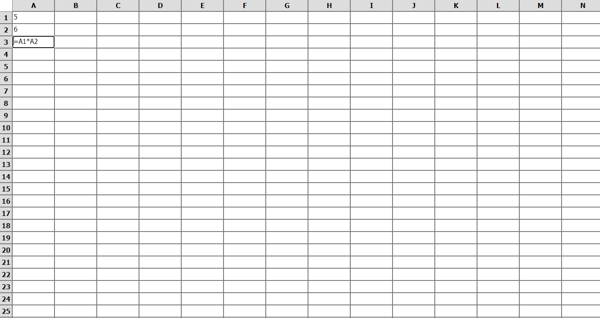

# Google Sheet Clone

This template should help get you started developing with Vue 3 in Vite.

## Recommended IDE Setup

[VSCode](https://code.visualstudio.com/) + [Volar](https://marketplace.visualstudio.com/items?itemName=Vue.volar) (and disable Vetur) + [TypeScript Vue Plugin (Volar)](https://marketplace.visualstudio.com/items?itemName=Vue.vscode-typescript-vue-plugin).

## Screen Shots



## Project Setup

```sh
pnpm i
or
npm i
```

### Compile and Hot-Reload for Development

```sh
pnpm dev
or
npm run dev
```
